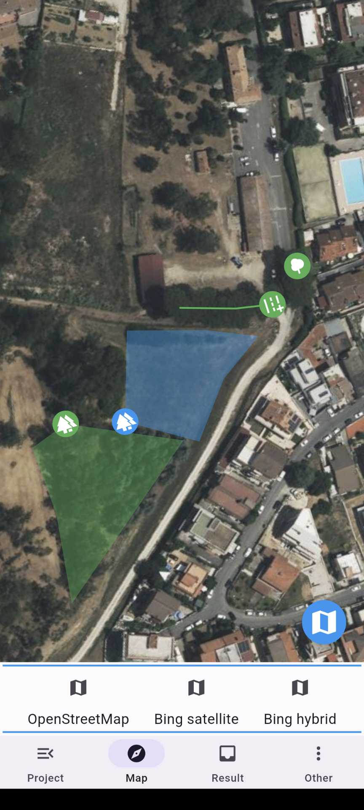
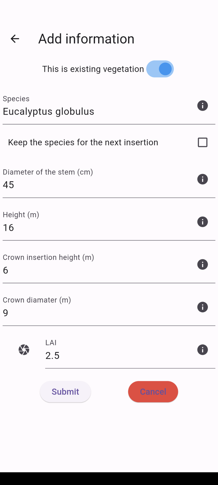
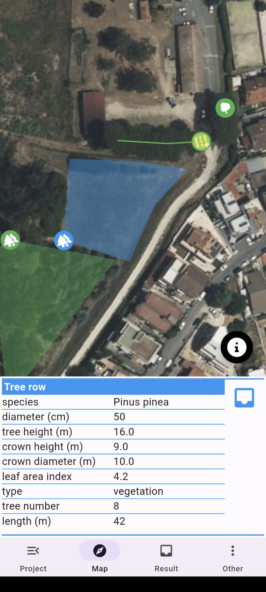
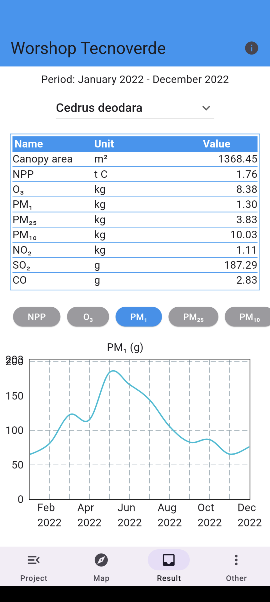

# Airtree app
&nbsp;&nbsp;&nbsp;&nbsp;&nbsp;&nbsp;&nbsp;&nbsp;


---

Copyright (c) 2023 Council for Agricultural Research and Economics (CREA)\
Fundings:  POR FESR Lazio 2014-2020 (POR), project TECNOVERDE, CUP B85F20003230006


     


## Description
The Airtree app allows you to survey and plan urban green within the Italian territory, with the possibility of geographically representing trees, rows and groves, and recording the species and various biometric characteristics, eg: trunk diameter, tree height.

This information can be transmitted to an Airtree server to estimate the quantities of carbon dioxide and air pollutants (e.g. particulate matter and ground-level ozone) removed by the trees.

The estimates are carried out with the Airtree model, implemented in the server and developed in collaboration between CREA and the National Research Council (CNR), which systematizes structural information of the trees (e.g. height of the tree, width of the crown), eco-physiological information (e.g. the speed of the chemical reactions involved in photosynthesis) and time series of climate data and air pollutants.

With this information, Airtree estimates the amount of light that is captured by the tree's canopy, simulates the opening of the stomata on the leaves (the pores through which trees breathe) and then calculates the amount of carbon and pollutants removed from the atmosphere.

## Platforms
Airtree app is currently being developed for Android.\
Testing through Goole play in coming soon

## Install from source code
1) set up the [Flutter framework](https://docs.flutter.dev/get-started/install)
2) clone the repository to a your directory (DIR)
3) set up an airtree server
4) set up the app environment
    - download the [env file](https://filedn.com/lJmhEDy1NtXRoqpqwjGBwUB/airtree/app/env)
    - edit the env file according to the comments
    - rename the file from "env" to ".env" and copy it in the DIR root
5) install the [envied](https://pub.dev/packages/envied) library
```
flutter pub add envied
flutter pub add --dev envied_generator
flutter pub add --dev build_runner
```
6) compile the env file and test the app on your android device
```
dart run build_runner build
flutter run
```


