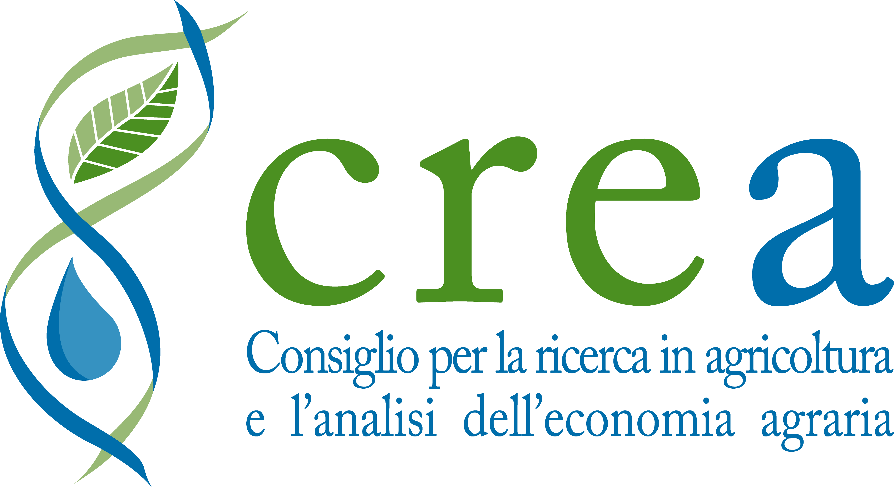
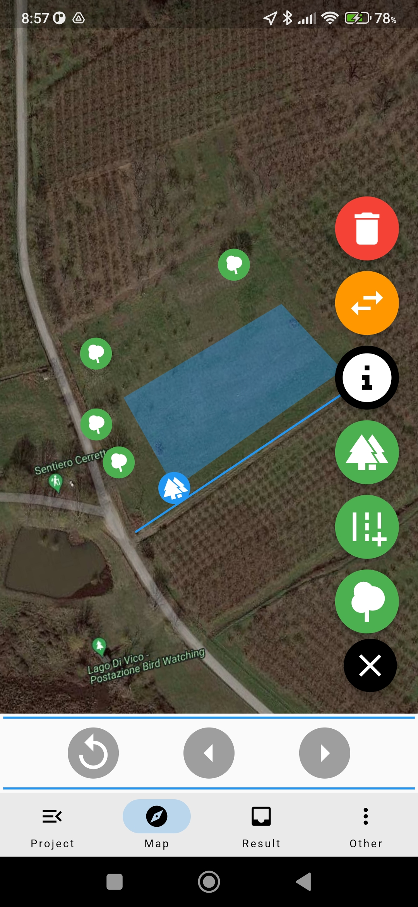
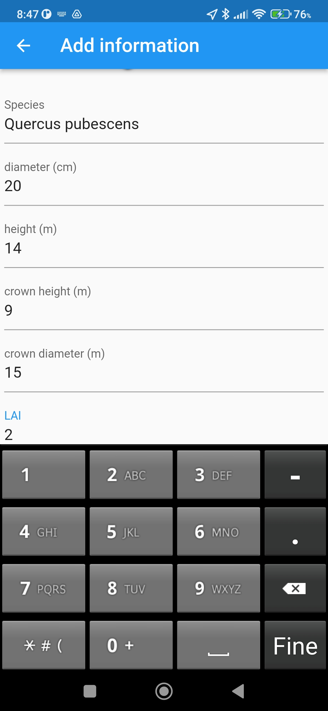
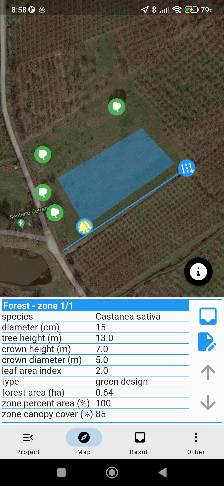
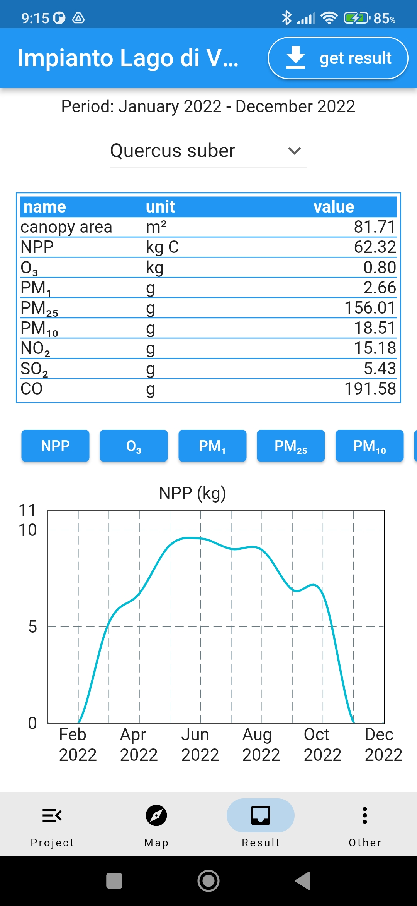

|  | Airtree app |  |

Copyright (c) 2023 Council for Agricultural Research and Economics (CREA)\
Fundings:  POR FESR Lazio 2014-2020 (POR), project TECNOVERDE, CUP B85F20003230006

     

The Airtree app allows you to survey and plan urban green within the Italian territory, with the possibility of geographically representing trees, rows and groves, and recording the species and various biometric characteristics, eg: trunk diameter, tree height.\

This information can be transmitted to the CNR servers to estimate the quantities of carbon dioxide and air pollutants (e.g. particulate matter and ground-level ozone) removed by the trees.

The estimates are carried out with the Airtree model, developed in collaboration between CREA and the National Research Council (CNR), which systematizes structural information of the trees (e.g. height of the tree, width of the crown), eco-physiological information (e.g. the speed of the chemical reactions involved in photosynthesis) and time series of climate data and air pollutants.

With this information, Airtree estimates the amount of light that is captured by the tree's canopy, simulates the opening of the stomata on the leaves (the pores through which trees breathe) and then calculates the amount of carbon and pollutants removed from the atmosphere.

